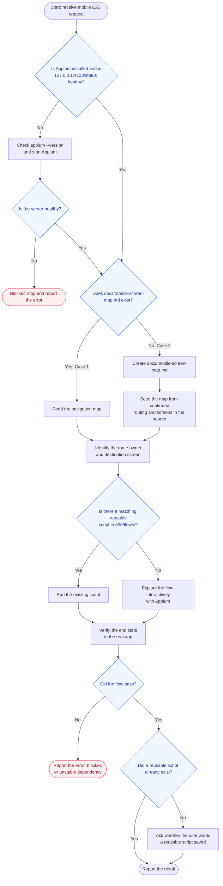
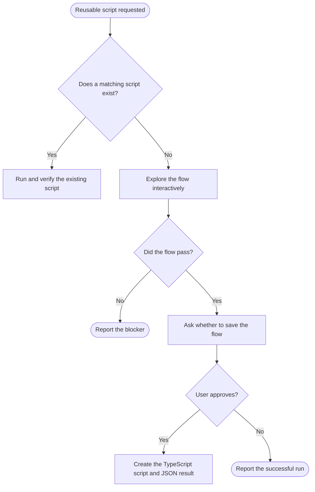

# Appium Mobile E2E

Use this skill to turn a product-level mobile flow request into a real Appium run.

## Prerequisite gate

Before any Appium mobile E2E work, verify the local Appium installation and server first. This is mandatory before selecting devices, preparing simulators, creating sessions, driving flows, or writing reusable scripts.

1. Check that Appium is installed and callable, for example with `appium --version` or the repo's documented Appium command.
2. Check whether a local Appium server is already running at `http://127.0.0.1:4723/status`.
3. If the local server is not running, start Appium locally with the repo's preferred command or the lightest standard command, then re-check `/status`.
4. Stop and report the blocker if Appium is not installed, cannot start, or `/status` does not respond successfully.
5. Only proceed to device selection, session creation, interactive driving, or script execution after the local Appium server is confirmed healthy.

## Decision flow

Use this flowchart as the canonical execution order. Choose exactly one documentation case before inspecting the app.



### Case 1: Project documentation exists

Condition: `docs/mobile-screen-map.md` exists.

1. Read the navigation map first.
2. Use the map to identify the route owner and destination screen.
3. Inspect only the files needed for the requested flow.
4. Prefer an existing TypeScript script in `e2e/flows/`; if none matches, explore the flow interactively with Appium.

### Case 2: Project documentation does not exist

Condition: `docs/mobile-screen-map.md` does not exist.

1. Create `docs/mobile-screen-map.md` before running the flow.
2. Seed the map from routing and screens confirmed in the source, using a route-to-screen format.
3. Use the new map to identify the route owner and destination screen.
4. Continue with the Case 1 workflow: run a matching TypeScript script or explore the flow interactively with Appium.

## Core workflow

1. Complete the prerequisite gate above.
2. Follow the documentation decision flow above.
3. Resolve the requested flow from navigation and inspect only its route owner and destination screens.
4. Use a matching TypeScript script from `e2e/flows/` when available; otherwise explore the flow interactively.
5. Run against the real Appium server and a concrete device or simulator.
6. Verify the end state from the app, not only that taps succeeded.
7. Report:
   - Appium local install/server status
   - route taken
   - whether the flow passed
   - any blocker that prevents reliable automation
8. If the flow passes and no matching reusable script existed, follow the reusable-script decision flow before creating one.

## Default execution rules

- Prefer visible product text, native predicates, and route knowledge over brittle broad searches.
- Use the navigation map to answer "which screen owns this flow?" before inspecting implementation.
- When a device or simulator target is already known, create the Appium session directly with explicit capabilities. Do not call device-selection or simulator-prep helpers first unless the target is unknown or unavailable.
- During discovery, use the interactive-first loop below. Do not write temporary scripts just to probe the next step.
- Do not call `generate_locators` as a default discovery step. Start with visible text and small targeted `find` queries; use full locator generation only as a debugging fallback.
- Do not fetch page source repeatedly by habit. Capture it at decision points: initial state, after an unexpected screen, or when a locator strategy fails.
- Accept first-launch Terms if present.
- Log in only when the login screen is actually visible.
- Do not mutate user data casually. Use unique temporary values when possible, or restore the original value after verification.
- If a shared UI component collapses controls into one native node, first inspect screenshot + source. Use sheet-relative or element-relative taps only when text/native locators are unavailable.
- Keep TypeScript scripts runnable with environment variables and optional `e2e/environment.ts` instead of hardcoded credentials or device ids.

## Reusable scripts

Use this decision flow when the user explicitly requests a reusable TypeScript script or when a new flow passes without an existing matching script.



When creating a reusable script:

- put the TypeScript flow script under `e2e/flows/` with a short feature name, for example `e2e/flows/booking.ts`
- run it with `npx ts-node e2e/flows/booking.ts`
- require `typescript`, `ts-node`, and `@types/node` in the target project
- keep configuration in environment variables with optional `e2e/environment.ts`
- write a JSON result file under `e2e/results/`
- follow the detailed template in `references/reusable-script-template.md`

## Fast path

Use this order when the local Appium server is healthy and the target device is known:

```text
1. create remote Appium session directly
2. inspect only enough state to identify current screen
3. drive the flow interactively in the live session
4. verify the result
5. ask whether to save a reusable TypeScript script if none existed
```

Use the fallback path only when necessary:

```text
select device -> prepare simulator -> create embedded session -> dump source -> generate all locators
```

Fall back when:

- no target device is known
- the device/simulator is not ready or cannot be reached
- the remote Appium server is unavailable
- the app is not installed on the target device

## Interactive-first loop

For a new flow, use this loop:

```text
look at current screen
-> make one small Appium action
-> inspect the result
-> continue
```

Temporary scripts are allowed only when the user explicitly requests a saved script, an existing reusable script is being validated, or a long deterministic replay is clearly faster than interactive exploration.

## Project-specific notes

- If shared UI components collapse multiple visible controls into one native node, derive coordinates from a stable containing element rather than hardcoding global screen coordinates.
- If the repo already contains Appium scripts, prefer copying their session and verification style.

## When blocked

- If the requested flow cannot be found in the router map, inspect the smallest likely route-owner files and update the map after confirming the path.
- If Appium cannot interact with a visual control, capture screenshot and page source before guessing.
- If a flow depends on unstable external data, state the dependency and use the least destructive verification possible.
- If a selector is ambiguous because the same label appears multiple times, disambiguate by container geometry or route context.

## Optional reference

- Read `references/flow-example.md` when you need a concrete worked example of how to move from route lookup to a live Appium run.
- Read `references/reusable-script-template.md` only when you need the full template for a saved reusable script.
